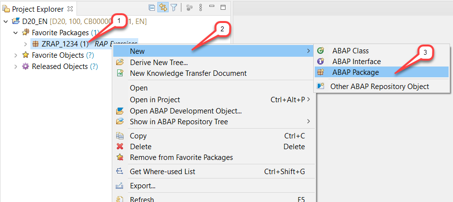
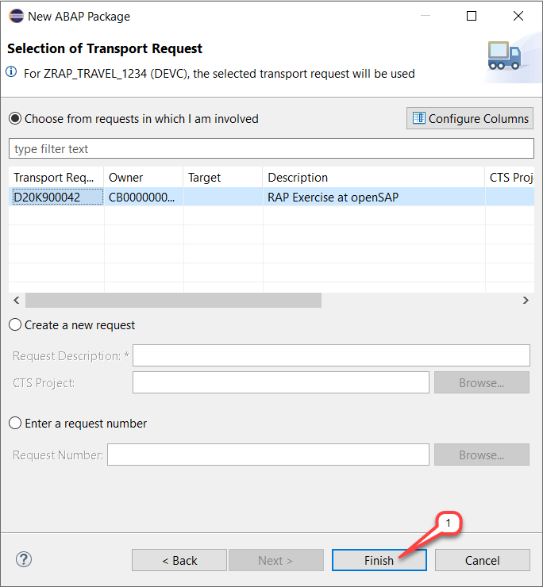
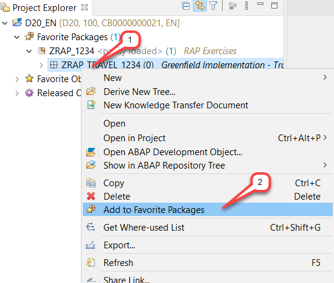
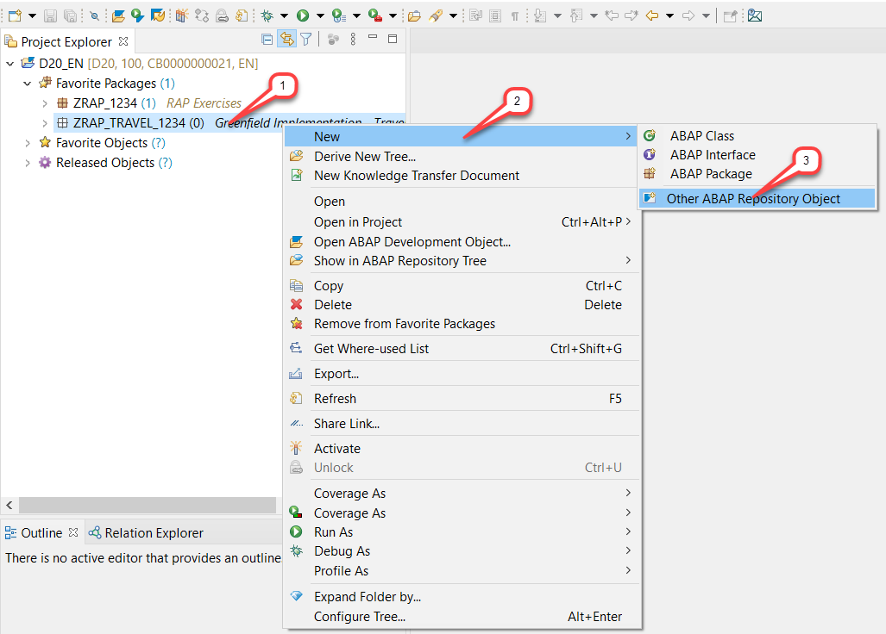
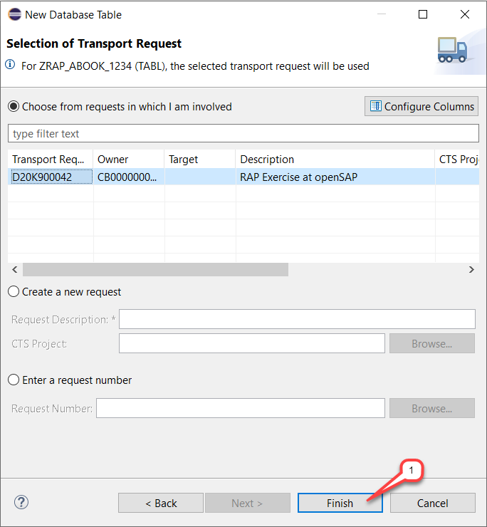
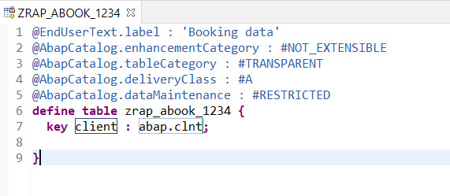
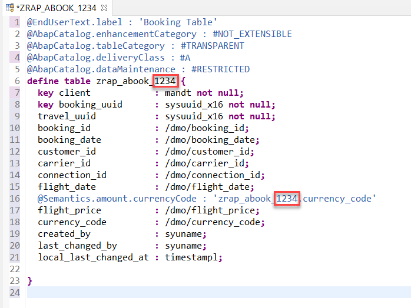
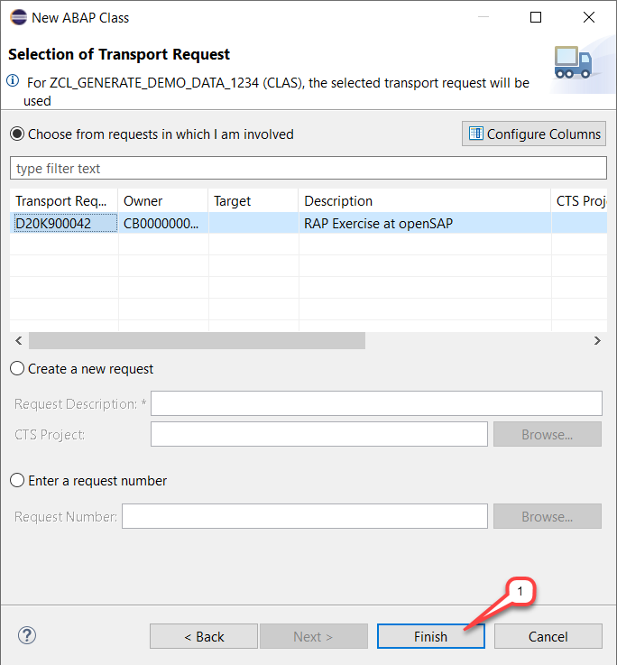
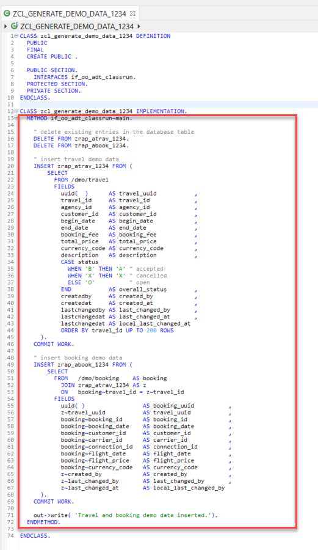

# HANDS-ON EXERCISE FOR WEEK 2 UNIT 2: CREATING THE DATABASE TABLES

## Introduction
In this hands-on exercise, you will create the database for storing the travel and booking data and fill them with demo data.   
     
You can watch [week 2 unit 2: Creating the Database Tables](https://open.sap.com/courses/cp13/items/2hlNxSdQ9JJZClJcxQOQb6) on the openSAP platform.
     
> **Hints and Tips**    
> Speed up the typing by making use of the Code Completion feature (shortcut *Ctrl+Space*) and the prepared code snippets provided. 
> You can easily open an object with the shortcut *Ctrl+Shift+A*, format your source code using the Pretty Printer feature *Ctrl+1* and toggle the fullscreen of the editor using the shortcut *Ctrl+M*.   
>
> A great overview of ADT shortcuts can be found here: [Useful ADT Shortcuts](https://blogs.sap.com/2013/11/21/useful-keyboard-shortcuts-for-abap-in-eclipse/)
>
> Please note that the placeholder **`####`** used in object names in the exercise description must be replaced with the suffix of your choice during the exercises. The suffix can contain a maximum of 4 characters (numbers and letters).
> The screenshots in this document have been taken with the suffix `1234` and system `D20`. Your system id will be `TRL`.

> Please note that the ADT dialogs and views may change in the future due to software updates.

Follow the instructions below.

## Step 1. Create the ABAP Package
First create the new ABAP package **`ZRAP_TRAVEL_####`** (where `####` is your chosen suffix) to group the various development artefacts that you’re going to create during the greenfield implementation of our Travel App. It will be a sub-package of package **`ZRAP_####`** (where `####` is your chosen suffix) created in week 1 unit 6.  
  
1. Go to the Project explorer, right-click on your package **`ZRAP_####`** (where `####` is your chosen suffix) you created in week 1 unit 6 and choose the context menu entry **_New > ABAP Package_**.  
   
    
  
2. Maintain **`ZRAP_TRAVEL_####`** as name (where `####` is your chosen suffix) and a meaningful description (e.g. _**Greenfield Implementation - Travel List Report App**_) and choose **Next** to continue.  
The Project and the Superpackage fields are automatically assigned.
   

    
    
  
4. Select an existing transport request or create a new one and then choose **Finish** to create the new package.  
   

    
  

    The package is now created.  
   

    
  
5. Right-click on the new created package and choose  **Add to Favorites Packages** to add it to your favorites.  
   

    
    
  
## Step 2. Create the Travel Database Table  
You will now create the database table **`ZRAP_ATRAV_####`** (where `####` is your chosen suffix),  to store the travel data.  
A Travel entity defines general travel data, such as the agency ID or customer ID, the status of the travel booking, and the price of travel.   
1. Right click on your package **`ZRAP_TRAVEL_####`**, choose **_New > Other ABAP Repository Object_** from the context menu.   
   

    

2. Enter `database` in the search field, choose **Database table** in the list and then choose **Next**.  
   

    

3. Maintain **`ZRAP_ATRAV_####`** as name and a meaningful description (e.g. _**Travel data**_) in the appearing dialog and choose **Next**.  
   

    

4. Assign a transport request and choose **Finish**.  
   

    

    The table is created, and the default code displayed in the new editor.  
    The default table-specific technical settings are specified using annotations at the top.  
 

      

5. Replace the default source code with the code snippet provided below and replace all occurrences of  `####` with your chosen suffix.  
    You can make use of the Replace All feature (**Ctrl+F**) in ADT for the purpose.   
  
    <pre>
    @EndUserText.label : 'Travel data'
    @AbapCatalog.enhancementCategory : #NOT_EXTENSIBLE
    @AbapCatalog.tableCategory : #TRANSPARENT
    @AbapCatalog.deliveryClass : #A
    @AbapCatalog.dataMaintenance : #RESTRICTED
    define table zrap_atrav_#### {
      key client            : mandt not null;
      key travel_uuid       : sysuuid_x16 not null;
      travel_id             : /dmo/travel_id;
      agency_id             : /dmo/agency_id;
      customer_id           : /dmo/customer_id;
      begin_date            : /dmo/begin_date;
      end_date              : /dmo/end_date;
      @Semantics.amount.currencyCode : 'zrap_atrav_####.currency_code'
      booking_fee           : /dmo/booking_fee;
      @Semantics.amount.currencyCode : 'zrap_atrav_####.currency_code'
      total_price           : /dmo/total_price;
      currency_code         : /dmo/currency_code;
      description           : /dmo/description;
      overall_status        : /dmo/overall_status;
      created_by            : syuname;
      created_at            : timestampl;
      last_changed_by       : syuname;
      last_changed_at       : timestampl;
      local_last_changed_at : timestampl;
    }
    </pre>
   

    
  

    **Short explanations:**  
    - Some data elements from the ABAP Flight Reference Scenario (namespace `/DMO/`) are used.  
    - The table key consists of the `CLIENT` field and the `TRAVEL_UUID` field which is a technical key (16 Byte UUID).   
    - A human-readable travel identifier: `TRAVEL_ID`  
    - The field CURRENCY_CODE is specified as currency key for the amount fields `BOOKING_FEE` and `TOTAL_PRICE` using the semantic annotation `@Semantics.amount.currencyCode`   
    - Some standard administrative fields are defined: `CREATED_BY`, `CREATED_AT`, `LAST_CHANGED_BY`, `LAST_CHANGED_AT` and `LOCAL_LAST_CHANGED_AT`.  
  
6. Save  and activate  the changes.  
  
7. Press **F8** to start the data preview.  
    Well, the database table is empty for now, so no data is displayed.  
   

    

## Step 3. Create the Booking Database Table
You will now create the database table **`ZRAP_ABOOK_####`** (where `####` is your chosen suffix),  to store the booking data.   
A Booking entity comprises general flight and booking data, the customer ID for whom the flight is booked as well as the travel ID to which the booking belongs – and some admin fields.  
  
1. Right click on the **Database Tables** folder, choose **New Database Table** from the context menu.  

    
  
3. Maintain **`ZRAP_ABOOK_####`** as name and a meaningful description (e.g. _**Booking data**_) in the appearing dialog and choose **Next**. 

    
  
4.  Assign a transport request and choose **Finish**.  

    

    The table is created, and the default code displayed in the new editor.  
    The default table-specific technical settings are specified using annotations at the top – before the **`DEFINE TABLE`** statement.     

    
  
5. Replace the default source code with the code snippet provided below and replace all occurrences of  `####` with your chosen suffix.   
    You can make use of the Replace All feature (shortcut **Ctrl+F**) in ADT for the purpose.  
  
    <pre> 
    @EndUserText.label : 'Booking data'
    @AbapCatalog.enhancementCategory : #NOT_EXTENSIBLE
    @AbapCatalog.tableCategory : #TRANSPARENT
    @AbapCatalog.deliveryClass : #A
    @AbapCatalog.dataMaintenance : #RESTRICTED
    define table zrap_abook_#### {
      key client            : mandt not null;
      key booking_uuid      : sysuuid_x16 not null;
      travel_uuid           : sysuuid_x16 not null;
      booking_id            : /dmo/booking_id;
      booking_date          : /dmo/booking_date;
      customer_id           : /dmo/customer_id;
      carrier_id            : /dmo/carrier_id;
      connection_id         : /dmo/connection_id;
      flight_date           : /dmo/flight_date;
      @Semantics.amount.currencyCode : 'zrap_abook_####.currency_code'
      flight_price          : /dmo/flight_price;
      currency_code         : /dmo/currency_code;
      created_by            : syuname;
      last_changed_by       : syuname;
      local_last_changed_at : timestampl;
    }
    </pre>   

    
  
    **Short explanations:**
    - Some data elements from the ABAP Flight Reference Scenario (namespace /DMO/) are used.  
    - The table key consists of the `CLIENT` field and the `BOOKING_UUID` field which is a technical key (16 Byte UUID).   
    - A human-readable travel identifier: `BOOKING_ID`  
    - The field CURRENCY_CODE is specified as currency key for the amount field FLIGHT_PRICE using the semantic annotation `@Semantics.amount.currencyCode`.  
    - Some standard administrative fields are defined: `CREATED_BY`, `LAST_CHANGED_BY`, and `LOCAL_LAST_CHANGED_AT`.  
  
  6. Save  and activate  the changes.  
  
7. Press **F8** to start the data preview.   
    Well, the database table is empty for now, so no data is displayed.  
 

    
  
## Step 4. Fill in the Database Tables with Demo Data
You will now fill in the created travel and booking database tables with some demo data to ease the test. Demo data provided by the ABAP Flight Reference Scenario (main package: `/DMO/FLIGHT`) will be used for the purpose.   
  
1. Right click on your package **_ZRAP_TRAVEL_####** and choose **_New > ABAP Class_** from the context menu.      

    

2. Maintain **`ZCL_GENERATE_DEMO_DATA_####`** as name and a meaningful description (e.g. _**Generate Travel and Booking demo data**_) in the creation wizard for the new ABAP class.  
    Add the ABAP interface **`IF_OO_ADT_CLASSRUN`** which needs to be implemented to write outputs to the ABAP Console and continue with **Next**.  

    

3. Assign a transport request and choose **Finish**.  
   
    

    The ABAP class is created and opened in the source-based class editor area, ready for you to implement.  
  
4. Insert the implementation of method **`if_oo_adt_classrun~main`**  with the code snippet provided below (after **CLASS zcl_generate_demo_data_#### IMPLEMENTATION.** and before **ENDCLASS.**) as shown on the screenshot below, and replace all occurrences of  `####` with your chosen suffix.   
You can make use of the Replace All feature (**Ctrl+F**) in ADT for the purpose.  
  
    <pre> 
    METHOD if_oo_adt_classrun~main.

    " delete existing entries in the database table
    DELETE FROM zrap_atrav_####.
    DELETE FROM zrap_abook_####.

    " insert travel demo data
    INSERT zrap_atrav_#### FROM (
        SELECT
          FROM /dmo/travel
          FIELDS
            uuid(  )      AS travel_uuid           ,
            travel_id     AS travel_id             ,
            agency_id     AS agency_id             ,
            customer_id   AS customer_id           ,
            begin_date    AS begin_date            ,
            end_date      AS end_date              ,
            booking_fee   AS booking_fee           ,
            total_price   AS total_price           ,
            currency_code AS currency_code         ,
            description   AS description           ,
            CASE status
              WHEN 'B' THEN 'A' " accepted
              WHEN 'X' THEN 'X' " cancelled
              ELSE 'O'          " open
            END           AS overall_status        ,
            createdby     AS created_by            ,
            createdat     AS created_at            ,
            lastchangedby AS last_changed_by       ,
            lastchangedat AS last_changed_at       ,
            lastchangedat AS local_last_changed_at
            ORDER BY travel_id UP TO 200 ROWS
      ).
    COMMIT WORK.

    " insert booking demo data
    INSERT zrap_abook_#### FROM (
        SELECT
          FROM   /dmo/booking    AS booking
            JOIN zrap_atrav_#### AS z
            ON   booking~travel_id = z~travel_id
          FIELDS
            uuid( )                 AS booking_uuid          ,
            z~travel_uuid           AS travel_uuid           ,
            booking~booking_id      AS booking_id            ,
            booking~booking_date    AS booking_date          ,
            booking~customer_id     AS customer_id           ,
            booking~carrier_id      AS carrier_id            ,
            booking~connection_id   AS connection_id         ,
            booking~flight_date     AS flight_date           ,
            booking~flight_price    AS flight_price          ,
            booking~currency_code   AS currency_code         ,
            z~created_by            AS created_by            ,
            z~last_changed_by       AS last_changed_by       ,
            z~last_changed_at       AS local_last_changed_by
      ).
    COMMIT WORK.

    out->write( 'Travel and booking demo data inserted.').
    ENDMETHOD.
    </pre>
   
    

    **Short explanations:**  
    - First, any existing entries in both database tables are deleted.  
    - Then the data is selected from the tables `/DMO/TRAVEL` and `/DMO/BOOKING` and inserted into your tables `ZRAP_ATRAV_####` and `ZRAP_ABOOK_####` respectively.  
    - The SQL function `UUID( )` is used to set the value of the key fields `TRAVEL_UUID` and `BOOKING_UUID`.   
    - The `COMMIT WORK` statement is then executed to persist the data. The data selection has been limited to up to 200 travel records, but you can change this if desired.  
    - A success message is written to the Console at the end.  
  
5. Save  and activate  the changes.  
  
6. Press **F9** to run the ABAP class as a console application to generate the demo data and and fill your tables.
   
    
  
7. Now you can preview the data from the Travel and Booking database tables.  
    Choose the relevant database table (`ZRAP_ATRAV_####` or `ZRAP_ABOOK_####` where #### is your chosen suffix) in the Project Explorer and press **F8**.  
        
    The Data Preview will open in the editor area.  
    You can play around with the data preview - e.g. choose the **Number of Entries** or **SQL Console**, or filter the entries with **Add filter**.
   
    

## Summary
You have completed the exercise!  
In this unit, you have learned how to use the ABAP Development Tools (ADT) to create database tables for your demo Travel app.

## Solution
Find the source code for the created database tables and class in the **[/week2/sources](/week2/sources)** folder:
- [W2U2_TABL_ZRAP_ATRAV_####](/week2/sources/W2U2_TABL_ZRAP_ATRAV.txt) 
-	[W2U2_TABL_ZRAP_ABOOK_####](/week2/sources/W2U2_TABL_ZRAP_ABOOK.txt) 
- [W2U2_CLAS_ZCL_GENERATE_DEMO_DATA_####](/week2/sources/W2U2_CLAS_ZCL_GENERATE_DEMO_DATA.txt) 
      
Do not forget to replace all the occurrences of `####` with your chosen suffix in the copied source code.
    
## Next exercise
[Week 2 Unit 3: Creating the Core Data Services (CDS) Data Model](unit3.md)
