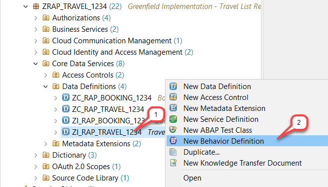
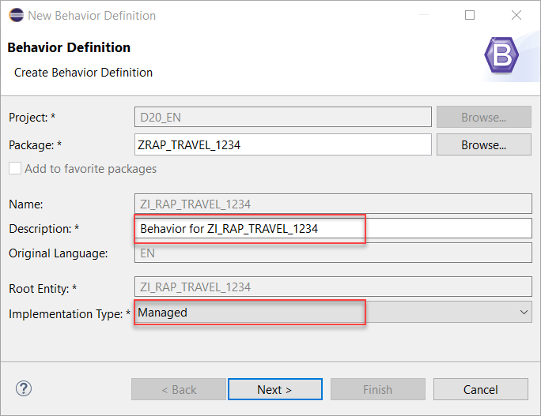
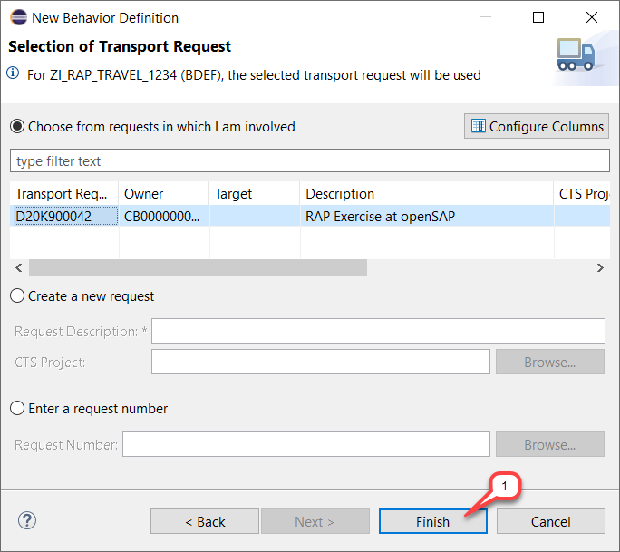
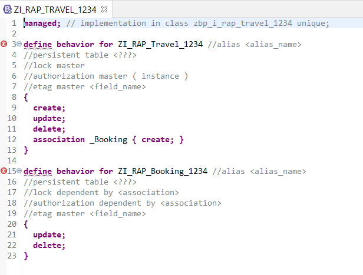
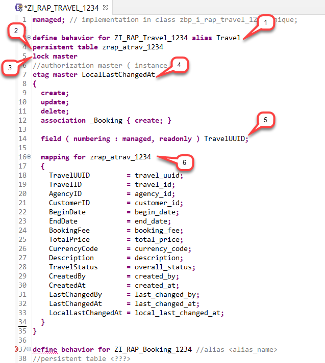
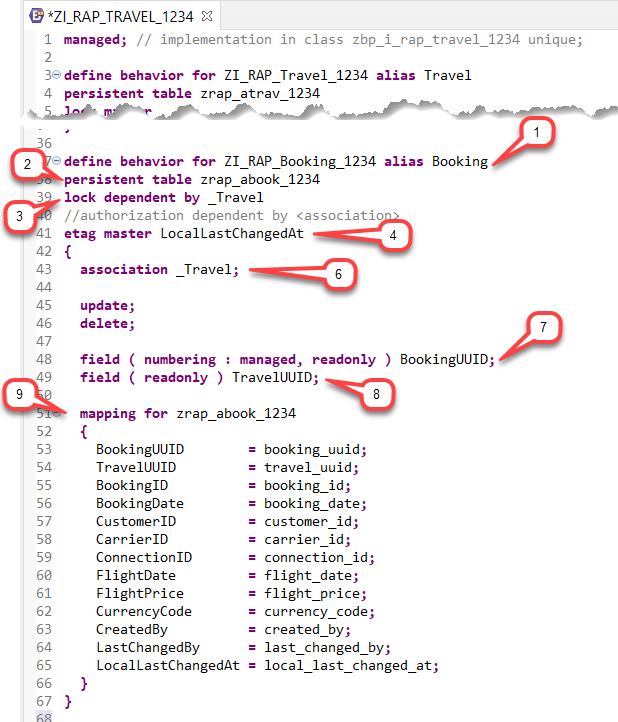
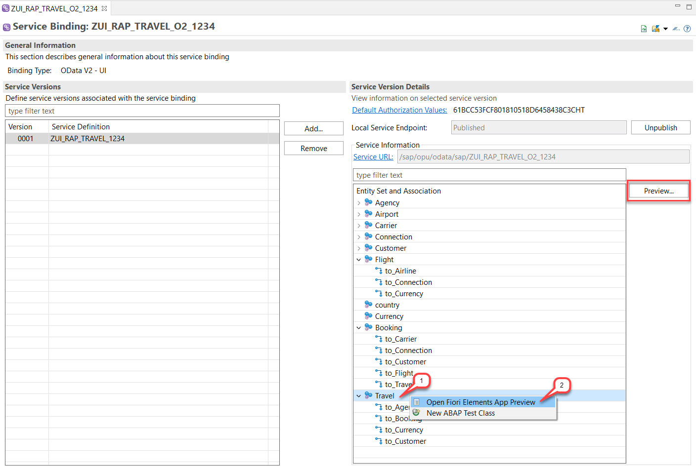

# HANDS-ON EXERCISE FOR WEEK 3 UNIT 2: DEFINING THE BASIC BUSINESS OBJECT BEHAVIOR

## Previous exercise:
[Week 2: Developing a Read-Only List Report App](/week2/README.md)

## Introduction
In the present hands-on exercise, you will define the basic transactional behavior of the Travel and the Booking entities – i.e., create update and delete – and test the enhanced SAP Fiori elements Travel app.   
    
You can watch [week 3 unit 2: Defining the Basic Business Object Behavior]( https://open.sap.com/courses/cp13/items/7xyqOu7UY1glChwsNcE3PI) on the openSAP platform.
     
> **Hints and Tips**    
> Speed up the typing by making use of the Code Completion feature (shortcut *Ctrl+Space*) and the prepared code snippets provided. 
> You can easily open an object with the shortcut *Ctrl+Shift+A*, format your source code using the Pretty Printer feature *Shift+F1* and toggle the fullscreen of the editor using the shortcut *Ctrl+M*.   
>
> A great overview of ADT shortcuts can be found here: [Useful ADT Shortcuts](https://blogs.sap.com/2013/11/21/useful-keyboard-shortcuts-for-abap-in-eclipse/)
>
> Please note that the placeholder **`####`** used in object names in the exercise description must be replaced with the suffix of your choice during the exercises. The suffix can contain a maximum of 4 characters (numbers and letters).
> The screenshots in this document have been taken with the suffix `1234` and system `D20`. Your system id will be `TRL`.

> Please note that the ADT dialogs and views may change in the future due to software updates.

Follow the instructions below.

## Step 1. Create the Behavior Definition
Behavior definitions for the BO entities of given composition model are created for the root CDS view and define the behavior for all contained entities. Therefore, you will create the behavior definition for the Travel BO view  **`ZI_RAP_TRAVEL_####`** (where **`####`** is your chosen suffix).

1.	Right-click on the CDS view  **`ZI_RAP_TRAVEL_####`** in the Project Explorer and choose **New Behavior Definition**.
 
       

2.	The _New Behavior Definition_ wizard is shown.  
    Project, Package and Root Entity have been assigned automatically. 
    The name of the behavior definition has to be the identical name as the root CDS view. That’s the reason why the name can’t be changed. A description is proposed. YOu can ajdust it if you like.  
    Ensure that the _Implementation Type_ is set to **`Managed`**  and choose **Next >**.  
          
    
    
3.	Assign a transport request and choose **Finish**. 
 
    
    
        
    A skeleton for the behavior definition for all entities – i.e. the Travel entity **`ZI_RAP_Travel_####`** and the Booking entity **`ZI_RAP_Booking_####`**  in the present scenario – is generated based on the chosen implementation type and displayed in the appropriate editor.   

    
    
    **Short explanation:**
    -	**`managed`** is specified as implementation type at the top.
    -	The basic CUD operations – i.e. Create, Update and Delete – are specified for both entities. 
    -	New booking entities can be created by association from a travel entity.
    -	Various comments (all starting with **`//`**) have been generated.  
            
    You will adjust the behavior definition in the next steps.

## Step 2. Adjust the Behavior Definition of the Travel Entity
First adjust the behavior definition for the Travel entity **`ZI_RAP_Travel_####`**
1.	Maintain **`Travel`** as alias in the **`define behavior for`** statement.      
    The alias will be used to easily access the entity via ABAP code.  

    <pre> alias Travel </pre>
    
2.	Specify the travel database table **`ZRAP_ATRAV_####`** as persistency by uncommenting the comment line **`persistent table <???>`** and enhancing it as follows:

    <pre> persistent table zrap_atrav_#### </pre>

3.	Enable the lock handling for the Travel entity which is the root node of the composition.  
    >**Please note:** The lock is handled generically by the RAP framework in the managed scenario.  
    
    For that, uncomment  the statement line **`lock master`**.  
    <pre> lock master</pre>    

4.	Enable the so-called optimistic lock – aka _ETag handling_ – for the Travel entity.  
    For that, uncomment the **`etag master`** statement and replace the **`<field_name>`**  to **`LastChangedAt`** in it.  

    <pre>etag master LocalLastChangedAt</pre>

5.	As this is a UUID based scenario, we want the managed runtime to automatically generate and assign a key when new instances are created.   
    To achieve this, specify the key field **`TravelUUID`** to be fully managed by the runtime and not editable from outside using the keywords **`numbering:managed`** and **`readonly`**. Add the new statement provided below after the statement **`association _Booking { create; }`**.
    <pre>
      field ( numbering : managed, readonly ) TravelUUID;
    </pre>

6.	Define a mapping between the persistency table fields and the CDS view fields for the travel entity.  
    Because we have provided aliases in the interface CDS views, we need to tell the framework how to map the element names in the CDS data model to the corresponding table fields.  

    Add the code snippet below to the behavior definition of the travel entity as shown on the screenshot below (_see recap_).    
    
    <pre>
      mapping for zrap_atrav_####
      {
        TravelUUID         = travel_uuid;
        TravelID           = travel_id;
        AgencyID           = agency_id;
        CustomerID         = customer_id;
        BeginDate          = begin_date;
        EndDate            = end_date;
        BookingFee         = booking_fee;
        TotalPrice         = total_price;
        CurrencyCode       = currency_code;
        Description        = description;
        TravelStatus       = overall_status;
        CreatedBy          = created_by;
        CreatedAt          = created_at;
        LastChangedBy      = last_changed_by;
        LastChangedAt      = last_changed_at;
        LocalLastChangedAt = local_last_changed_at;
      }
    </pre>
    
        
7.	**Recap: Travel behavior definition of the travel entity**   
    The behavior definition of the Travel entity and its source code will look as follows:   
 
       

    <pre>
    define behavior for ZI_RAP_Travel_1234 alias Travel
    persistent table zrap_atrav_1234
    lock master
    //authorization master ( instance )
    etag master LocalLastChangedAt
    {
      create;
      update;
      delete;
      association _Booking { create; }

      field ( numbering : managed, readonly ) TravelUUID;

      mapping for zrap_atrav_1234
      {
        TravelUUID         = travel_uuid;
        TravelID           = travel_id;
        AgencyID           = agency_id;
        CustomerID         = customer_id;
        BeginDate          = begin_date;
        EndDate            = end_date;
        BookingFee         = booking_fee;
        TotalPrice         = total_price;
        CurrencyCode       = currency_code;
        Description        = description;
        TravelStatus       = overall_status;
        CreatedBy          = created_by;
        CreatedAt          = created_at;
        LastChangedBy      = last_changed_by;
        LastChangedAt      = last_changed_at;
        LocalLastChangedAt = local_last_changed_at;
      }
    }
    </pre>
        
8.	Save but **DO NOT** yet activate the changes.  
    
## Step 3. Adjust the Behavior Definition of the Booking Entity  
Now, adjust the behavior definition for the Booking entity **`ZI_RAP_Booking_####`**.  

1.	Maintain **`Booking`** as alias in the **`define behavior for`** statement.  
    The alias will be used to easily access the entity via ABAP code.   
    
    <pre> alias Booking </pre>
    
2.	Specify the booking database table **`ZRAP_ABOOK_####`** as persistency by uncommenting the comment line **`persistent table <???>`** and enhancing it as follows:  
    <pre> persistent table zrap_abook_#### </pre>

3.	Enable the lock handling for the Booking entity which is a child node in the composition model – Travel being the lock master as the root entity. For this reason, the booking entity is lock dependent and makes use of the **`_Travel`** association defined in the appropriate CDS view.  
    For that, uncomment  the statement line **` lock dependent by`** and replace the entry **`<association>`** with **`_Travel`**.  
    <pre> lock dependent by _Travel</pre>

    > As already mentioned above, the lock is handled generically by the framework in the managed scenario.

4.	Enable the so-called optimistic lock for the Booking entity.     
    For that, uncomment the **`etag master`** statement and replace the **`<field_name>`**  to **`LastChangedAt`** in it.  

    <pre>etag master LocalLastChangedAt</pre>
         
    >**Please note**  
    >Defining two ETag masters happens on purpose. The recommended approach is to have a local etag for each entity. This is achieved by specifying an etag master on each node. 

5.	In order to transactional enable the **`_Travel`** association explicitly add it in the list between the curly brackets. You can add it at the top.  
    <pre>  association _Travel; </pre>

6.	As this is a UUID based scenario, we also want the managed runtime to automatically generate and assign a key when new instances are created. To achieve this, specify the key field **`BookingUUID`** to be fully managed by the runtime and not editable from outside using the keywords **`numbering:managed`** and **`readonly`**.  

    Specify the statement below at the bottom of the behavior definition.  
        
    <pre>
      field ( numbering : managed, readonly ) BookingUUID;
    </pre>

7.	There is one warning indicating that the TravelUUID in the booking entity should be set to readonly, as it is used in the on-condition of the association.

    In order to solve this, add the following line to the behavior definition.    
    <pre>  field ( readonly ) TravelUUID; </pre>

8.	Define a mapping between the persistency table fields and the CDS view fields for the travel entity.  
    Because we have provided aliases in the interface CDS views, we need to tell the framework how to map the element names in the CDS data model to the corresponding table fields.   
    
    Add the code snippet below to the behavior definition of the booking entity as shown on the screenshot below (_see recap_).  

    <pre>
      mapping for zrap_abook_####
      {
        BookingUUID        = booking_uuid;
        TravelUUID         = travel_uuid;
        BookingID          = booking_id;
        BookingDate        = booking_date;
        CustomerID         = customer_id;
        CarrierID          = carrier_id;
        ConnectionID       = connection_id;
        FlightDate         = flight_date;
        FlightPrice        = flight_price;
        CurrencyCode       = currency_code;
        CreatedBy          = created_by;
        LastChangedBy      = last_changed_by;
        LocalLastChangedAt = local_last_changed_at;
      }
    </pre>

9.	**Recap: Behavior definition of the Booking entity**   
    The behavior definition of the Booking entity and its source code will look as follows:   

    

    <pre>
    define behavior for ZI_RAP_Booking_1234 alias Booking
    persistent table zrap_abook_1234
    lock dependent by _Travel
    //authorization dependent by <association>
    etag master LocalLastChangedAt
    {
      association _Travel;

      update;
      delete;

      field ( numbering : managed, readonly ) BookingUUID;
      field ( readonly ) TravelUUID;

      mapping for zrap_abook_1234
      {
        BookingUUID        = booking_uuid;
        TravelUUID         = travel_uuid;
        BookingID          = booking_id;
        BookingDate        = booking_date;
        CustomerID         = customer_id;
        CarrierID          = carrier_id;
        ConnectionID       = connection_id;
        FlightDate         = flight_date;
        FlightPrice        = flight_price;
        CurrencyCode       = currency_code;
        CreatedBy          = created_by;
        LastChangedBy      = last_changed_by;
        LocalLastChangedAt = local_last_changed_at;
      }
    }
    </pre>

10.	Save  and activate  the changes now.

## Step 4. Preview the Travel App
Now, you can check the impact of this changes to your app.  
1.	Open your service binding **`ZUI_RAP_TRAVEL_O2_####`** (where `####` is your chosen suffix).  
    You can use the ADT shortcut **Ctrl+Shift+A** to open a development object.

2.	Start your application by choosing the **`Travel`** node in _**Entities Set and Association**_ area and right-click on it and choose _**Open Fiori elements App preview**_ from the context menu or simply double-click on it – or choose the **Preview** button.  
     
    

    
Your SAP Fiori elements-based Travel List Report app will open in the browser.  
Provide your ABAP user credentials if required and press **Go** to load the back-end data.  
Well, you will see no change: No create, no update, no delete option. This is because you have not yet projected the defined behavior definition, and therefore you still have a read-only app.  
    
   
    
## Summary
You have completed the exercise!  
In this unit, you have learned how to 
-	Create the BO behavior definition for the travel and booking entities
-	Define the standard transactional BO behavior of each entity
-	Test the enhanced SAP Fiori elements app

## Solution
Find the source code of the created CDS behavior definition **[sources](/week3/sources)** folder:
   - [W3U2_BDEF_ZI_RAP_TRAVEL_####](/week3/sources/W3U2_BDEF_ZRAP_I_TRAVEL_.txt)    
    
Do not forget to replace all the occurrences of ‘####’ with your chosen suffix in the copied source code.
 
## Next exercise
[Week 3 Unit 3: Creating the Business Object Behavior Projection](unit3.md)

